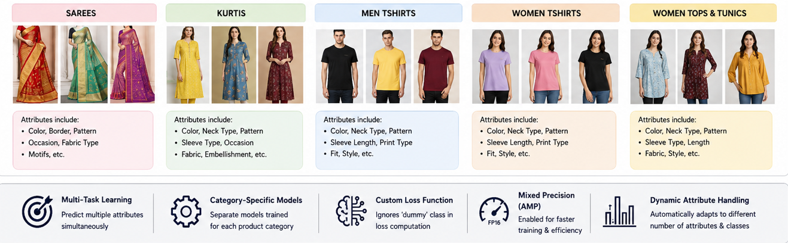
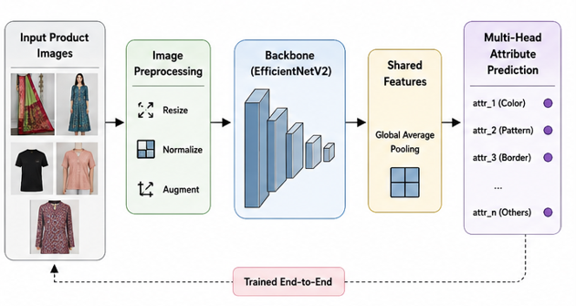

# Meesho Visual Taxonomy Challenge

Multi-attribute product classification system built for the Meesho Visual Taxonomy Data Challenge 2024 using EfficientNetV2-based multi-output deep learning models.

The project predicts multiple product attributes directly from product images, helping automate product catalog generation for e-commerce platforms.

---

# Overview

E-commerce platforms frequently face issues with incomplete or incorrect product metadata.

For example:
- a short-sleeve t-shirt may be listed as full-sleeve
- a printed saree may be tagged as solid
- product styles and patterns may be mislabeled

This project focuses on automatically predicting product attributes from product images alone.

The system was developed for the **Meesho Visual Taxonomy Data Challenge 2024**.

Competition link:  
https://www.meesho.io/ai/data-challenge

---

# Problem Statement

Given a product image, predict multiple product attributes such as:

- color
- pattern
- sleeve type
- border style
- neck type
- usage category
- embellishment details
- fabric style

The challenge uses a multi-attribute classification setup where different product categories contain different attribute sets.

---

# Product Categories

Separate models were trained for each category:

- Sarees
- Kurtis
- Men Tshirts
- Women Tshirts
- Women Tops & Tunics

Each category contains different attribute definitions and prediction targets.

---

# Product Categories Visualization



---

# Overall Pipeline



---

# Approach

Instead of training one universal model for all product types, category-specific models were trained independently.

Each category uses:
- its own preprocessing pipeline
- separate attribute mappings
- separate training configuration
- dedicated prediction heads

The overall pipeline:

1. Filter dataset by category
2. Dynamically generate attribute mappings
3. Encode attribute labels
4. Train EfficientNetV2-based multi-head model
5. Predict all attributes simultaneously

---

# Model Architecture

The project uses a multi-output classification architecture built on top of EfficientNetV2 backbones.

Different categories used different EfficientNetV2 variants depending on experimentation and category complexity:
- EfficientNetV2S
- EfficientNetV2M
- EfficientNetV2L

Each attribute is predicted using an independent softmax classification head.

Pipeline structure:

```text
Input Image
     ↓
EfficientNetV2 Backbone
     ↓
Shared Feature Representation
     ↓
Global Average Pooling
     ↓
Dropout
     ↓
Multiple Attribute Heads
 ├── attr_1
 ├── attr_2
 ├── attr_3
 └── ...
```

---

# Key Features

- Multi-task attribute prediction
- Category-specific models
- Dynamic attribute handling
- EfficientNetV2 backbone
- TensorFlow mixed precision training
- Custom masked categorical loss
- Automated dataset parsing
- Dynamic label encoding pipeline
- Multi-head classification architecture

---

# Dynamic Attribute Handling

Different categories contain different numbers of attributes.

The pipeline dynamically:
- generates attribute names
- extracts unique labels
- creates alias mappings
- builds output heads automatically

This allows the same training pipeline to adapt across categories without hardcoding class definitions.

---

# Custom Loss Function

Missing attributes were represented using a dummy class.

A custom categorical cross-entropy loss function was implemented to ignore dummy labels during training.

This prevents missing attributes from negatively affecting optimization.

---

# Training Details

Different categories used different hyperparameters and training configurations during experimentation.

Configurations included variations in:
- learning rate
- EfficientNetV2 backbone size
- mixed precision usage
- random seed
- dropout settings
- batch size

Common settings included:
- image size: 384x384
- AdamW optimizer
- TensorFlow / Keras
- categorical softmax outputs

---

# Repository Structure

```text
meesho-visual-taxonomy-challenge/
│
├── notebooks/
│   ├── train-images-sorted.ipynb
│   ├── test-images-sorted.ipynb
│   └── submission.ipynb
│
├── training/
│   ├── v1_men_tshirts.ipynb
│   ├── v2_kurtis.ipynb
│   ├── v3_sarees.ipynb
│   ├── v4_women_tshirts.ipynb
│   └── v5_women_tops_tunics.ipynb
│
├── assets/
│   ├── pipeline.png
│   └── categories.png
│
├── requirements.txt
├── .gitignore
└── README.md
```

---

# Installation

Clone the repository:

```bash
git clone https://github.com/sqqshh/Meesho-Visual-Taxonomy-Challenge.git
cd meesho-visual-taxonomy-challenge
```

Install dependencies:

```bash
pip install -r requirements.txt
```

---

# Dataset Preparation

Download the competition dataset and organize files similarly to:

```text
dataset/
│
├── train.csv
├── test.csv
├── train_images/
└── test_images/
```

---

# Training

First run image sorting notebook:

```bash
notebooks/train-images-sorted.ipynb
```

Then run category-specific training notebooks from the `training/` directory.

Example:

```bash
training/v3_sarees.ipynb
```

---

# Inference

Run:

```bash
notebooks/test-images-sorted.ipynb
```

Then generate predictions using:

```bash
notebooks/submission.ipynb
```

---

# Libraries Used

- TensorFlow
- Keras
- EfficientNetV2
- NumPy
- Pandas
- Matplotlib
- PIL

---

Competition link:

https://www.meesho.io/ai/data-challenge
